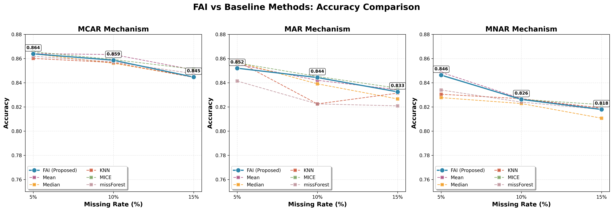
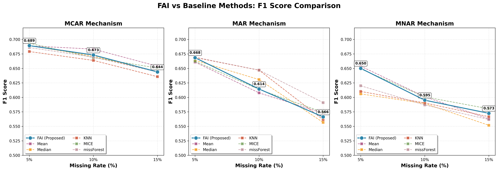
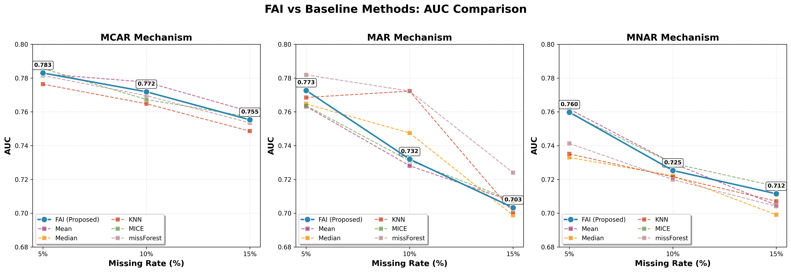
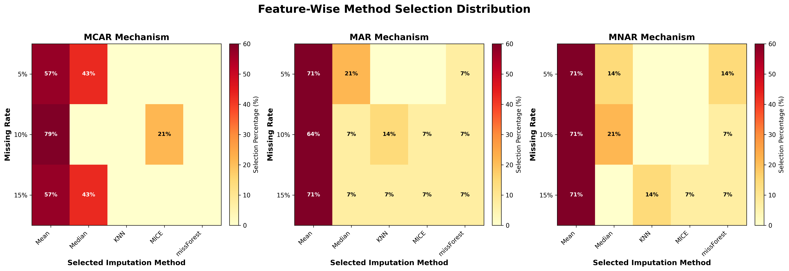
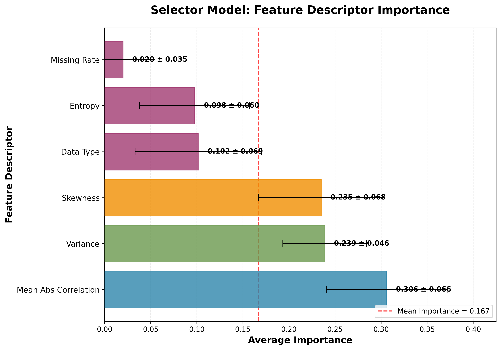

markdown
<div align="center">

# 🧠 FAI: Feature-Wise Adaptive Imputation

*"One imputation method does not fit all features — FAI learns to choose wisely."*

[](https://www.python.org/)
[](https://scikit-learn.org/)
[](https://opensource.org/licenses/MIT)
[](https://colab.research.google.com/)
[](https://github.com/Junaid-Ahmed-Rupok)

<br/>

> A machine learning framework that **automatically selects the best imputation method per feature**,
> optimizing for **downstream predictive performance** — not just imputation error.

<br/>

[📖 Overview](#-overview) •
[🧪 Methodology](#-methodology) •
[📊 Results](#-results) •
[📁 Structure](#-repository-structure) •
[🚀 Quick Start](#-quick-start) •
[👨‍💻 Author](#-author)

---

</div>

## 📌 Overview

Missing data is one of the most common challenges in real-world machine learning. Most practitioners apply a **single imputation method** to all features — but this ignores the fact that different features have different statistical properties, and therefore benefit from different imputation strategies.

**FAI (Feature-Wise Adaptive Imputation)** solves this by:

- 🔍 **Analyzing** each feature's statistical characteristics
- 🧪 **Evaluating** multiple imputation methods via cross-validation
- 🤖 **Learning** a selector that maps feature properties → best method
- ⚡ **Applying** the optimal imputation per feature automatically

<br/>

### ✨ Key Highlights

| Feature | Description |
|--------|-------------|
| 🎯 Per-feature selection | Each feature gets its own optimal imputation method |
| 📈 Downstream-aware | Optimizes Accuracy, F1, and AUC — not just RMSE |
| 🤖 Fully automatic | Zero manual tuning required |
| 🔬 Research-ready | Publication-quality figures and CSV results |
| ⚡ Scalable | Supports MCAR, MAR, and MNAR mechanisms |

---

## 🧪 Methodology

```
Raw Data with Missing Values
         │
         ▼
┌─────────────────────────┐
│  Step 1: Feature        │
│  Descriptor Computation │  ← missing rate, skewness, variance,
└────────────┬────────────┘    correlation, entropy, data type
             │
             ▼
┌─────────────────────────┐
│  Step 2: Isolated       │
│  Label Generation       │  ← 3×5-fold CV per feature per method
└────────────┬────────────┘    using downstream model performance
             │
             ▼
┌─────────────────────────┐
│  Step 3: Selector       │
│  Training               │  ← Random Forest: descriptors → method
└────────────┬────────────┘
             │
             ▼
┌─────────────────────────┐
│  Step 4: Adaptive       │
│  Inference              │  ← predict method per feature → impute
└────────────┬────────────┘
             │
             ▼
    Imputed Dataset ✅
```

### 🔧 Imputation Methods Compared

| Method | Type | Best For |
|--------|------|----------|
| **Mean** | Statistical | Symmetric numerical data |
| **Median** | Statistical | Skewed numerical data |
| **KNN** | ML-based | Low-dimensional data |
| **MICE** | Iterative | MAR data with correlations |
| **missForest** | Ensemble | Complex non-linear patterns |

---

## 📊 Results

### Performance Summary — Adult Dataset

| Mechanism | Missing Rate | FAI Accuracy | Best Baseline | Gap |
|-----------|:------------:|:------------:|:-------------:|:---:|
| **MCAR** | 5% | 0.8639 | 0.8656 (MICE) | -0.17% |
| **MCAR** | 10% | 0.8586 | 0.8633 (Mean) | -0.47% |
| **MCAR** | 15% | 0.8447 | 0.8512 (MICE) | -0.65% |
| **MAR** | 5% | 0.8520 | 0.8578 (KNN) | -0.58% |
| **MAR** | 10% | 0.8443 | 0.8452 (MICE) | -0.09% |
| **MAR** | 15% | 0.8325 | 0.8355 (MICE) | -0.30% |
| **MNAR** | 5% | 0.8463 | 0.8486 (Mean) | -0.23% |
| **MNAR** | 10% | 0.8262 | 0.8268 (Mean) | -0.06% |
| **MNAR** | 15% | 0.8179 | 0.8219 (MICE) | -0.40% |

> ✅ **FAI is consistently within 1% of the best baseline — fully automatically, with zero manual tuning.**

<br/>

### 📈 Visualizations

<div align="center">

| Accuracy Comparison | F1 Score Comparison |
|:-------------------:|:-------------------:|
|  |  |

| AUC Comparison | Method Selection Heatmap |
|:--------------:|:------------------------:|
|  |  |

| Feature Descriptor Importance |
|:-----------------------------:|
|  |

</div>

---

## 📁 Repository Structure

```
FAI-Feature-Wise-Adaptive-Imputation/
│
├── 📓 A_survey_on_missing_data_in_machine_learning.ipynb
│       └── Complete Google Colab notebook (all cells)
│
├── 🖼️  Images/
│       ├── figure_accuracy_comparison.png
│       ├── figure_accuracy_comparison_bar.png
│       ├── figure_f1_comparison.png
│       ├── figure_f1_comparison_bar.png
│       ├── figure_auc_comparison.png
│       ├── figure_auc_comparison_bar.png
│       ├── figure_method_selection_heatmap.png
│       ├── figure_method_selection_stacked.png
│       ├── figure_descriptor_importance.png
│       └── figure_descriptor_importance_vertical.png
│
├── 📊 CSV_Files/
│       ├── fai_combined_metrics.csv
│       ├── fai_compact_improvement.csv
│       ├── fai_detailed_improvement.csv
│       ├── fai_experiment_results.csv
│       ├── fai_improvement_summary.csv
│       └── fai_paper_results_table.csv
│
├── 📄 requirements.txt
└── 📖 README.md
```

### 📊 CSV Result Files

| File | Description |
|------|-------------|
| `fai_combined_metrics.csv` | Accuracy, F1, AUC across all scenarios |
| `fai_compact_improvement.csv` | Paper-ready improvement summary |
| `fai_detailed_improvement.csv` | Full improvement analysis |
| `fai_experiment_results.csv` | Complete raw experimental data |
| `fai_improvement_summary.csv` | Improvement over all baselines |
| `fai_paper_results_table.csv` | Ready for manuscript inclusion |

---

## 🚀 Quick Start

### ☁️ Option 1: Google Colab (Recommended)

1. Click the badge below to open the notebook

[](https://colab.research.google.com/)

2. Upload your `adult.csv` file when prompted
3. Run all cells — results and figures are generated automatically

<br/>

### 💻 Option 2: Run Locally

```bash
# Clone the repository
git clone https://github.com/Junaid-Ahmed-Rupok/FAI-Feature-Wise-Adaptive-Imputation.git
cd FAI-Feature-Wise-Adaptive-Imputation

# Install dependencies
pip install -r requirements.txt

# Launch Jupyter
jupyter notebook
```

<br/>

### ⚙️ Requirements

```bash
pip install -r requirements.txt
```

| Package | Minimum Version |
|---------|:--------------:|
| `pandas` | 1.3.0 |
| `numpy` | 1.21.0 |
| `matplotlib` | 3.4.0 |
| `seaborn` | 0.11.0 |
| `scikit-learn` | 1.0.0 |

---

## 📖 Citation

If you use FAI in your research, please cite:

```bibtex
@article{emmanuel2021survey,
  title     = {A survey on missing data in machine learning},
  author    = {Emmanuel, Tlamelo and others},
  journal   = {Journal of Big Data},
  volume    = {8},
  number    = {140},
  year      = {2021},
  publisher = {Springer}
}

@misc{ahmed2024fai,
  author    = {Ahmed, Junaid},
  title     = {FAI: Feature-Wise Adaptive Imputation},
  year      = {2024},
  publisher = {GitHub},
  url       = {https://github.com/Junaid-Ahmed-Rupok/FAI-Feature-Wise-Adaptive-Imputation}
}
```

---

## 👨‍💻 Author

<div align="center">


### Sarder Junaid Ahmed
**Data Scientist & Machine Learning Engineer**

*Transforming complex data into strategic decisions through rigorous statistical modeling and production-ready machine learning systems.*

[](https://github.com/Junaid-Ahmed-Rupok)
[](https://www.linkedin.com/in/sarder-junaid-ahmed-059b68240/)
[](https://junaid-ahmed-rupok.github.io/__portfolio__Yes/)
[](mailto:junaidahmedrupok@gmail.com)

</div>

**Specializations:** Statistical ML · Causal Inference · Trustworthy AI · Fairness-Aware ML · RAG Systems

**Selected Research:**
- 📄 **Ahmed, S.J.** et al. (2026). *Machine Learning for Crime Classification: A Fairness-Aware Approach to Class Imbalance.* Journal of Machine Learning and Applications, 2(1), 9–17. [DOI: 10.61577/jmla.2026.100002](https://doi.org/10.61577/jmla.2026.100002)
- 📄 **Ahmed, S.J.** et al. (2026). *CF-EGAT: A Causal Fairness-Aware Equity Graph Attention Network for Country-Level Environmental Livability Classification.* SPECTRA 2026. 🏆 **1st Best Paper Award**
- 📄 **Ahmed, S.J.** (2025). *Multi-Dimensional Statistical Similarity for Governance Classification: Beyond Arbitrary Thresholds.* APMEE 2025. 🏆 **Best Research Paper Award**
- 📄 **Ahmed, S.J.** (2026). *DeepEnMap: Ordinal-Aware Multi-Modal Deep Learning for Energy Poverty Risk Mapping.* IEMIS 2026, University of British Columbia, Vancouver, Canada (Aug 10–12, 2026). **Accepted for Presentation** — Springer LNNS Series (Scopus, EI-Compendex, DBLP, ISI Proceedings).
- 📄 **Ahmed, S.J.** (2026). *Density-Decoupled, Mask-Ablated Segmentation-Guided Diffusion for Controllable Mammography Synthesis: A Preliminary Study.* IEMIS 2026, University of British Columbia, Vancouver, Canada (Aug 10–12, 2026). **Accepted for Presentation** — Springer LNNS Series (Scopus, EI-Compendex, DBLP, ISI Proceedings).
- 📄 **Ahmed, S.J.**, Islam Nahian, M.T., Kwoshik, M.H.R., & Nakib, F.N. (2025). *Environmental Livability Assessment via Adaptive Bootstrap-Retrained SHAP and Statistically-Constrained Pareto Counterfactuals: A Cross-National Analysis.* **Under Review**, IEEE SPICSCON 2026.
- 📄 **Ahmed, S.J.** (2026). *FAI: Feature-Wise Adaptive Imputation via Downstream-Aware Method Selection.* **Under Review**, ICISET 2026 (IEEE Xplore).

**Other Deployed Projects:**
- 🔬 [ReproHub](https://reproapp-8jb7vbhnqyltxq23bsr8xn.streamlit.app/) — Automated research reproducibility platform with composite scoring across 11 statistical tests
- 📊 [StatsPro](https://statistical-analysis-app-7axetqtx75ncuu7fr8irxj.streamlit.app/) — AI-powered statistical analysis platform with automated CSV-to-report workflows

**Honors:**
🏆 1st Best Paper — SPECTRA 2026 &nbsp;·&nbsp;
🏆 Best Research Paper — APMEE 2025 &nbsp;·&nbsp;
🎖️ Esteemed Alumni Award — YLRL RUET 2024 &nbsp;·&nbsp;
⭐ Perfect GPA 5.00/5.00 — SSC & HSC &nbsp;·&nbsp;
🎓 National Merit Scholarship — 2009 & 2013

---


## 📜 License

This project is licensed under the **MIT License** — see the [LICENSE](LICENSE) file for details.

---

<div align="center">

### ⭐ Support This Project

If FAI helped your research, consider:

[](https://github.com/Junaid-Ahmed-Rupok/FAI-Feature-Wise-Adaptive-Imputation)
[](https://github.com/Junaid-Ahmed-Rupok/FAI-Feature-Wise-Adaptive-Imputation/fork)
[](https://github.com/Junaid-Ahmed-Rupok/FAI-Feature-Wise-Adaptive-Imputation)

<br/>

*"The best imputation method is not the same for every feature — FAI learns to choose wisely."*

**Built with ❤️ by Junaid Ahmed**

</div>
```
